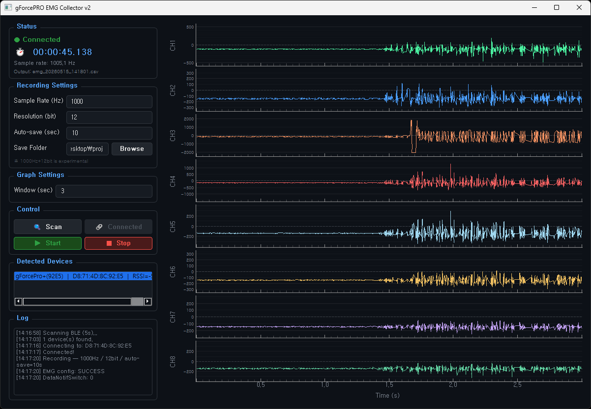

# gForcePRO EMG Monitor

Real-time 8-channel EMG visualization tool for the **OYMotion gForcePRO** armband.

A companion tool to [gforcepro_emg_collector](https://github.com/anna-jaekyung-lee/gforcepro_emg_collector). Built for **live signal monitoring** during experiments. Lightweight, responsive, and graph-first.

---

## Screenshots



---

## Why a Separate Tool?

The original collector (`collect_emg.py`) is feature-rich: filters, IMU, baseline correction, configurable settings. Great for data collection sessions.

But when you just want to **see the signal in real time**, such as check electrode contact, verify muscle activation, and monitor during experiments, all those settings get in the way.

This tool strips it back to what matters for live monitoring:

| | gforcepro_emg_collector | gforcepro_emg_monitor |
|---|---|---|
| Real-time graph | ❌ | ✅ 8ch, 20fps |
| Software filters | ✅ | ❌ |
| IMU (Quaternion) | ✅ | ❌ |
| Baseline correction | ✅ | ❌ |
| Auto-save (CSV) | ✅ | ✅ |
| Lightweight | — | ✅ pyqtgraph |

---

## Features

- **Real-time 8-channel EMG graph** : 20fps, pyqtgraph (GPU-accelerated, no lag)
- **Configurable time window** : set how many seconds to display
- **1000Hz / 12-bit** support (experimental, firmware confirmed)
- **Auto-save** by sample count (interval × sample rate)
- **Monotonic timestamps** : cumulative sample counter, never negative
- **Dark UI** : easy on the eyes during long sessions

---

## Installation

```bash
pip install bleak numpy pyqtgraph PyQt5
```

Python 3.8+. Tested on Windows 11.

---

## Usage

```bash
python collect_emg_v2.py
```

1. **Scan** : finds nearby gForcePRO devices
2. **Connect** : select device and connect
3. Configure sample rate, resolution, auto-save interval
4. **Start** : graph begins streaming live
5. **Stop** : CSV saved automatically

---

## Files

```
collect_emg_v2.py    — Main application
gforce.py            — gForcePRO BLE SDK wrapper (bug-fixed)
```

`gforce.py` is shared with the collector repo, same bug-fixed version.

---

## Related

- [gforcepro_emg_collector](https://github.com/anna-jaekyung-lee/gforcepro_emg_collector) — Full-featured data collection tool (filters, IMU, baseline correction)

---

## References

- [OYMotion gForcePRO](https://oymotion.github.io/en/gForce/gForcePro/gForcePro/)
- [gForceSDKPython (original)](https://github.com/oymotion/gForceSDKPython)
